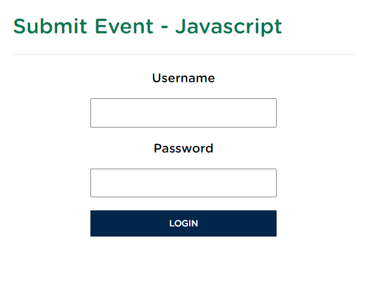

# 🔐 Simple Form with PHP Submission

This project demonstrates a simple form with **username** and **password** fields, styled using **CSS** and processed by a **PHP** script. The form submission is handled with **JavaScript**, sending data via an AJAX request to the `login.php` script.

## 🚀 Features

-   **Login Form:** Contains two fields, `username` and `password`, with a styled submit button.
-   **AJAX Submission:** Uses JavaScript to send form data without refreshing the page.
-   **Responsive Design:** The form is styled to be responsive and adapts to different screen sizes.
-   **PHP Form Handling:** Data is submitted to a PHP script (`login.php`), which handles and displays the form data.

## 🛠️ Technologies Used

-   **HTML:** Structure of the form.
-   **CSS:** Custom styling for the form layout.
-   **JavaScript:** Handles form submission with AJAX.
-   **PHP:** Processes the submitted form data.

## 📋 File Structure

-   `index.html`: The main HTML file containing the form.
-   `style.css`: The CSS file that styles the form.
-   `script.js`: JavaScript file handling the form submission.
-   `login.php`: PHP script to process and display the form data.

## 📋 Usage

### Step 1: Clone the repository

```bash
git clone https://github.com/viorelss/JS_Form.git
```

### Step 2: Setup a local PHP environment

To run the project locally, you need a local PHP server. You can use tools like **XAMPP**, **WAMP**, **MAMP**, or **Laragon**.

1. **Install PHP locally** using one of the tools above.
2. Move the project files to the server's root directory:
    - For **XAMPP**, this is usually the `htdocs` folder.
    - For **MAMP**, this is usually the `htdocs` folder in the MAMP directory.

### Step 3: Run the local server

1. Start your local server (e.g., using the XAMPP control panel or similar).
2. Navigate to `http://localhost/JS_Form` or the appropriate path depending on where you moved the project files.

### Step 4: Interact with the form

1. Open the `index.html` file in your browser by going to `http://localhost/JS_Form/index.html`.
2. Fill in the form with a **username** and **password**.
3. Click **Login** to submit the form.  
   The form data will be sent to the `login.php` script via an AJAX request, and the submitted data will be displayed in the browser console.

## 🖼️ Project Screenshot

<div align="center">
  
</div>

## 🛠️ How It Works

1. **HTML Form:**  
   The form is structured in `index.html` with two input fields (username and password) and a submit button.
2. **CSS Styling:**  
   The form and its elements are styled in `style.css` using the **Gotham Rounded** font and a clean layout that ensures a modern and responsive design.
3. **JavaScript (AJAX Submission):**  
   The form submission is handled in `script.js`. When the form is submitted, an event listener intercepts the submission, preventing the default page refresh. The form data is then sent via an **AJAX** request to the `login.php` script using the `XMLHttpRequest` object.
4. **PHP Processing:**  
   In `login.php`, the form data is captured and displayed using `var_dump($_POST);`, which prints the submitted data for testing purposes.

## 🛠️ File Overview

-   `index.html`:  
     Contains the form structure and references the external CSS and JavaScript files.

-   `style.css`:  
     Includes styles for form elements, ensuring a clean, responsive, and modern layout.

-   `script.js`:  
     Contains the JavaScript logic that prevents form refresh and sends the data asynchronously to `login.php` via AJAX.

-   `login.php`:  
     A simple PHP script that processes the form data and outputs it for testing purposes.

### Example PHP Output

When submitting the form with the username "JohnDoe" and password "123456", the PHP output will look like this in the browser:

```php
array(2) {
  ["username"]=>
  string(7) "JohnDoe"
  ["password"]=>
  string(6) "123456"
}
```

## 🤝 Contributing

Contributions are welcome! If you have suggestions to improve the styling, enhance form validation, or add more features, feel free to fork the repository and submit a pull request.

1. Fork the project.
2. Create a new branch (`git checkout -b feature/YourFeature`).
3. Commit your changes (`git commit -m 'Add new feature'`).
4. Push to the branch (`git push origin feature/YourFeature`).
5. Open a pull request.

## 🌐 Deployment

To deploy this project on a live server, ensure that **PHP** is supported on the server. Simply upload the project files to your hosting provider's root directory.

---

### 🔗 Links

-   [GitHub Repository](https://github.com/viorelss/JS_Form)
